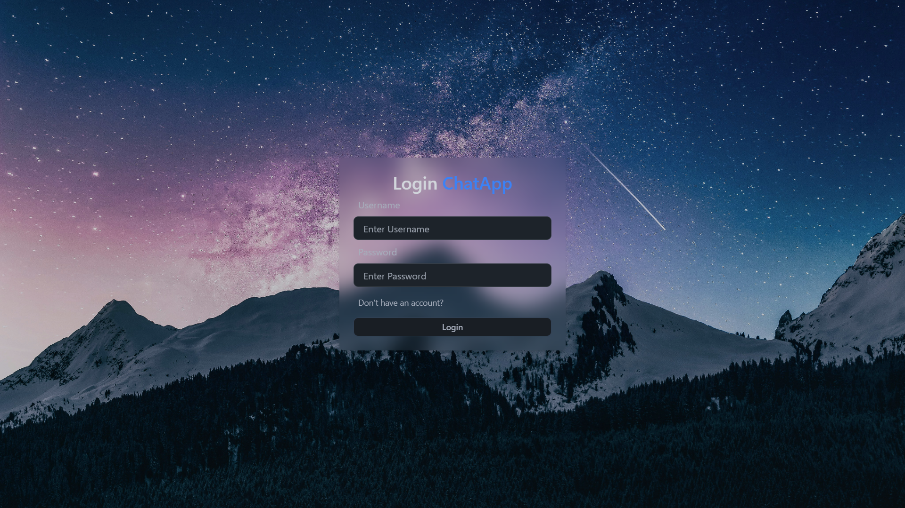
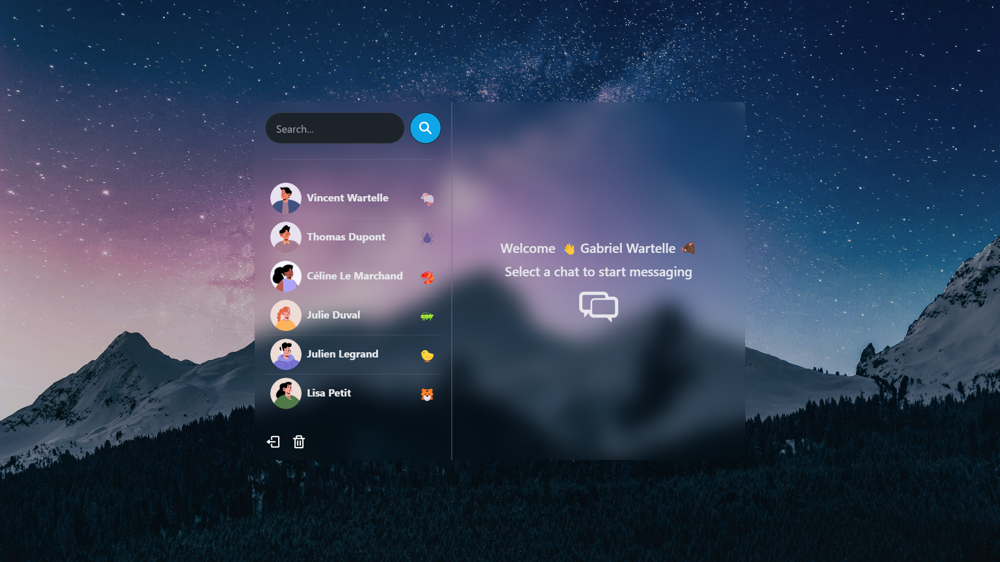
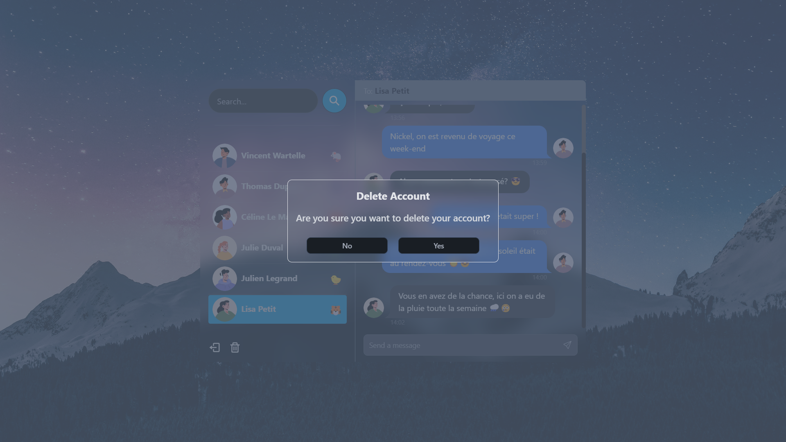

<a id="readme-top"></a>

<!--
*** This README is built upon the Best-README-Template, created by Othneil Drew.
*** If you wish to use this template, go check his repository :
*** https://github.com/othneildrew/Best-README-Template/tree/master
*** And don't forget to give his project a star!
-->

<!-- PROJECT TITLE -->

<div align="center">
  <a href="https://chatapp-oy8v.onrender.com/">
    
  </a>
</div>
<h1 align="center">ChatApp</h1>

<!-- TABLE OF CONTENTS -->

<details>
  <summary>Table of Contents</summary>
  <ol>
    <li>
      <a href="#about-the-project">About The Project</a>
      <ul>
        <li><a href="#built-with">Built With</a></li>
      </ul>
    </li>
    <li>
      <a href="#getting-started">Getting Started</a>
      <ul>
        <li><a href="#prerequisites">Prerequisites</a></li>
        <li><a href="#backend">Backend</a></li>
        <li><a href="#frontend">Frontend</a></li>
      </ul>
    </li>
    <li><a href="#usage">Usage</a></li>
    <li><a href="#modifications">Modifications</a></li>
    <li><a href="#improvements">Improvements</a></li>
    <li><a href="#contact">Contact</a></li>
    <li><a href="#acknowledgments">Acknowledgments</a></li>
    <li><a href="#license">License</a></li>
  </ol>
</details>

<!-- ABOUT THE PROJECT -->

<h2 id="about-the-project">About The Project</h2>


If you want to take a direct look at this project, you can do so right [here](https://chatapp-oy8v.onrender.com/).

This project was built following this [tutorial](https://www.youtube.com/watch?v=HwCqsOis894).

ChatApp is a realtime messaging web app, built using the MERN Stack (MongoDB, Express.js, React, Node.js).

On the backend, we have some basic CRUD operations: creating an account, logging in and out, and deleting an account.
Passwords are encrypted using Bcryptjs, the authentication and authorization is delt with using JSON Web Token, and the real-time messaging with Socket.io.

On the frontend, we use Zustand for global state management, React Hot Toast for user notifications, and React Context combined with Socket.io for online status. The styling is done with TailwindCSS and Daisy UI.

This project has been deployed on Render, using a free tier account, so the app has some spin up time before loading.

<p align="right">(<a href="#readme-top">back to top</a>)</p>

<h3 id="built-with">Built With</h3>

- Tech stack :

[](https://react.dev/)
[](https://nodejs.org/en)
[](https://expressjs.com/)
[](https://www.mongodb.com/)

- Tools :

[](https://vitejs.dev/)
[](https://tailwindcss.com/)
[](https://daisyui.com/)
[](https://reactrouter.com/en/main)
[](https://socket.io/)
[](https://jwt.io/)

<p align="right">(<a href="#readme-top">back to top</a>)</p>

<!-- GETTING STARTED -->

<h2 id="getting-started">Getting Started</h2>

<h3 id="prerequisites">Prerequisites</h3>

If you want to clone this project, you must have [Node.js](https://nodejs.org/en) installed, as well as [Git](https://git-scm.com/downloads).

1. To clone this project, first go in the directory you want to install the project in :

   ```sh
   cd path/to/your/directory
   ```

2. And then run this command to clone the project :

   ```sh
   git clone https://github.com/GWartelle/ChatApp.git
   ```

<h3 id="backend">Backend</h3>

1. For the backend, in the root of the project, start by running the command `npm install` to install all the packages :

   ```sh
   npm install
   ```

2. Next, in the editor of your choice, open the .env.example file. For example, using VSCode, you can run this command :

   ```sh
   code .env.example
   ```

3. Update the environment variables with your own :

   ```js
   PORT=...
   MONGO_DB_URI=...
   JWT_SECRET=...
   NODE_ENV=...
   ```

   For the PORT, you can choose whichever one you prefer.

   For the MONGO_DB_URI, you can create your own free database on [MongoDB](https://www.mongodb.com/).

   For JWT_SECRET, a random string of characters will do the trick.
   To easily create one, open a bash terminal and run this commmand :

   ```ba
   openssl rand -base64 32
   ```

   For NODE_ENV, leave it as `development` unless you plan to deploy the app, in which case you should change it to `production`.

4. Once it's done, change the name of the file to `.env` :

   ```sh
   mv .env.example .env
   ```

5. Lastly, to start the server using nodemon, run this command :

   ```sh
   npm run server
   ```

<h3 id="frontend">Frontend</h3>

1. For the frontend, you must go in the frontend folder and run the command `npm install` :

   ```sh
   cd frontend
   npm install
   ```

2. And to run the React app using Vite.js, run this command :

   ```sh
   npm run dev
   ```

3. You can now click on the link after `Local:` to open up the project on the browser of your choice.

<p align="right">(<a href="#readme-top">back to top</a>)</p>

<!-- USAGE EXAMPLES -->

<h2 id="usage">Usage</h2>



You will land on the login page.
Here you can obviously log in, using your username and your password.
But if you don't have an account yet, you can click on `Don't have an account?` to be redirected to the register page.


Here you will be asked to enter your full name, your username, your password, and to confirm it.
You'll also be asked to choose between `Male` and `Female` (only used to generate a random profile picture for your account).
If you already created an accoount you can just click on `Already have an account?`.



Once logged in, you'll land on the home page.
On the left of the page you'll see the full list of users.
If you want to find a specific user, you can search for him/her using the search bar at the top.
Once you found the user you want to talk to, simply click on his/her profile picture or name.


Once you selected a user, it'll open the discussion panel.
Here you can simply type any message you want in the message bar at the bottom of the screen, and click on the send icon to the right to send your message.
Your message will be instantly sent to the other user, and appear on the page.


Lastly, once you're done using the app, you can simply click on the logout icon at the bottom left of the page to instantly log out.
And if you ever want to delete your account, you can click on the trash icon.
A modal will then appear on the screen, and ask you if you are sure you want to delete your account.

<p align="right">(<a href="#readme-top">back to top</a>)</p>

<!-- MODIFICATIONS -->

<h2 id="modifications">Modifications</h2>

Compared to the original project, I decided to tweak things a little bit: I changed the background, I got rid of the notification sound and the shaking animation of new messages as it was getting rather annoying 😅, etc ...

But one major thing I added to this project is the delete account feature, as I think it really is a requirement.

So I wanted to share with you how I did to implement this function.
To begin with, let's take a look a the backend logic, the `deleteAccount` controller :

```js
export const deleteAccount = async (req, res) => {
 try {
   const user = req.user;

   // Delete the user's conversations
   const conversations = await Conversation.find({ participants: user._id });
   for (const conversation of conversations) {
     const messages = await Message.find({ conversation: conversation._id });
     for (const message of messages) {
       await Message.deleteOne({ _id: message._id });
     }
     await Conversation.deleteOne({ _id: conversation._id });
   }

   // Delete the user
   await User.findByIdAndDelete(user._id);

   res.clearCookie("jwt");
   res.status(204).json({ message: "Account deleted successfully" });
 } catch (error) {
   console.error("Error in delete account controller", error.message);
   res.status(500).json({ error: "Internal Server Error" });
 }
```

After getting the user from the request sent by the frontend, the controller finds all the conversations this user had.
And within each of these conversations, the controller goes through all the messages and deletes them one by one.

Once all the messages from a conversation are deleted, it is time to delete the conversation itself, and then tackle the next one.
The controller reapeat this cycle until every messages and every conversations this user had have been deleted.

When this is done, the only thing left to do for the controller is to delete the user itself, and then clear its token from the cookies to effectively log the user out.

And now let's take a look at the frontend logic that deals with this, the `useDelete` hook :

```js
const useDelete = () => {
  const [loading, setLoading] = useState(false);
  const { setAuthUser } = useAuthContext();

  const deleteAccount = async () => {
    setLoading(true);
    try {
      const res = await fetch("/api/auth/delete-account", {
        method: "DELETE",
        headers: { "Content-Type": "application/json" },
      });
      if (!res.ok) {
        throw new Error("Failed to delete account");
      }

      localStorage.removeItem("chat-user");
      setAuthUser(null);
      toast.success("Successfully deleted account!");
    } catch (error) {
      toast.error(error.message);
    } finally {
      setLoading(false);
    }
  };

  return { loading, deleteAccount };
};
```

This React hook first sets up a loading state, which is initiated to false, and gets the setter of the authentication context.

The `deleteAccount` function itself then sets the loading state to true, for the time of the API call, and tries to fetch for the `delete-account` route of the backend.

After checking if the API responded correctly, the hook proceeds to remove the user from the local storage, then sets the authentication context to null and notifies the user of the successful deletion of the account.

Finally, the hook sets the loading state back to false.
This hooks returns the loading state itself and the `deleteAccount` function.

Most of the logic is now dealt with, the only thing left to do for the frontend is to call this hook, in the DeleteButton component (the trash icon) :

```js
const DeleteButton = () => {
  const { loading, deleteAccount } = useDelete();
  const [isModalOpen, setIsModalOpen] = useState(false);

  const handleDeleteAccount = async () => {
    await deleteAccount();
    setIsModalOpen(false);
  };

  return (
    <div>
      {!loading ? (
        <>
          <BiTrash
            className="w-6 h-6 text-white cursor-pointer"
            title="Delete Account"
            onClick={() => setIsModalOpen(true)}
          />
          <ConfirmationModal
            isOpen={isModalOpen}
            onRequestClose={() => setIsModalOpen(false)}
            onConfirm={handleDeleteAccount}
          />
        </>
      ) : (
        <span className="loading loading-spinner"></span>
      )}
    </div>
  );
};
```

This component first gets the `loading` state and the `deleteAccount` function from the `useDelete()` hook.

Next, it creates a `isModalOpen` state to control the display of the `ConfirmationModal` component, which is by default set to false.

The `deleteAccount()` function is called by the `handleDeleteAccount` handle, which also sets the `setIsModalOpen` state to false.

When the trash icon is clicked, the `isModalOpen` state is set to true.
This state is passed on to `ConfirmationModal`, along with its setter, and the `handleDeleteAccount` handle.

So, let's finally take a look at this `ConfirmationModal` component :

```js
const ConfirmationModal = ({ isOpen, onRequestClose, onConfirm }) => {
  return (
    <Modal
      isOpen={isOpen}
      onRequestClose={onRequestClose}
      contentLabel="Confirmation Modal"
    >
      <h2 className="text-xl font-bold mb-4 text-gray-200">Delete Account</h2>
      <p className="text-lg font-semibold mb-4 text-gray-300">
        Are you sure you want to delete your account?
      </p>
      <div className="flex justify-evenly">
        <button
          className="btn w-5/12 btn-sm mt-2 border border-slate-700 hover:text-white"
          onClick={onRequestClose}
        >
          No
        </button>
        <button
          className="btn w-5/12 btn-sm mt-2 border border-slate-700 hover:bg-red-700 hover:border-red-700 hover:text-white"
          onClick={onConfirm}
        >
          Yes
        </button>
      </div>
    </Modal>
  );
};
```

The `isOpen` attribute of this modal controls its display based on the `isModalOpen` state that has been passed on, which can also be set back to false with `onRequestClose`.

This modal simply asks the user to make a choice between `No` which calls `onRequestClose` and closes the modal, and `Yes` which calls the `deleteAccount` function using the handle passed on to `onConfirm`.

Once this is done, the user's account is effectively deleted, and he/she is sent back to the login page.

And that's all for the delete account feature !

<p align="right">(<a href="#readme-top">back to top</a>)</p>

<!-- IMPROVEMENT  -->

<h2 id="improvements">Improvements</h2>

As this project is primarily built for training purposes, it is rather light in terms of features.
Therefore, if I had more time on my hands to improve this web app, here are the features I would implement :

- Firstly, the most important point in my opinion, would be to add responsivity. This is a crucial feature for all modern web apps, and this project lacks it.
- Secondly, I would add a friend list feature. Instead of being able to send messages to every users, one user should have to ask another to be his/her friend before sending him/her a message.
- Thirdly, it'd be a great improvement if it was possible to upload images, videos and audios in discussions, as it is a staple feature in most real-time messaging apps.
- Fourthly, it would be rather logical to add some account update feature. The user would be able to choose a different profile picture, select a specific emoji to represent his/her account, and could change his/her username or password.
- Fifthly, in the same vein of the preceding feature, it would be coherent to have a password retrieval feature, as it is a staple of all modern apps.

After that, this project could benefit from other little tweaks like ordering other users' profiles based on which discussion is the most recent, or notifying the user when he/she receives a new message from another discussion, but I think this would be a good start.

<p align="right">(<a href="#readme-top">back to top</a>)</p>

<!-- CONTACT -->

<h2 id="contact">Contact</h2>

If you want to see more of my work, I invite you to go check my [portfolio](https://gwartelle.github.io/MyPortfolio/).

You can also take a look at my other projects on my [github](https://github.com/GWartelle),

And if you'd like to get in touch with me, feel free to reach out on [LinkedIn](https://www.linkedin.com/in/gabriel-wartelle/).

<p align="right">(<a href="#readme-top">back to top</a>)</p>

<!-- ACKNOWLEDGMENTS -->

<h2 id="acknowledgments">Acknowledgments</h2>

As mentionned above, this project was made following this [tutorial](https://www.youtube.com/watch?v=HwCqsOis894).
So I would like to thank its creator for his amazing work.
If you want to go check the github of his tutorial you can do so right [here](https://github.com/burakorkmez/mern-chat-app?tab=readme-ov-file).
Feel free to give him a star, as his work was well structured and his explanations clear and useful.

And of course I would like to thank you for taking the time to read through all this !
I wish you the best 😁

Have a great day 😉

<p align="right">(<a href="#readme-top">back to top</a>)</p>

<!-- LICENSE -->

<h2 id="license">License</h2>

Distributed under the MIT License. See [opensource.org](https://opensource.org/license/mit) for more information.

<p align="right">(<a href="#readme-top">back to top</a>)</p>
